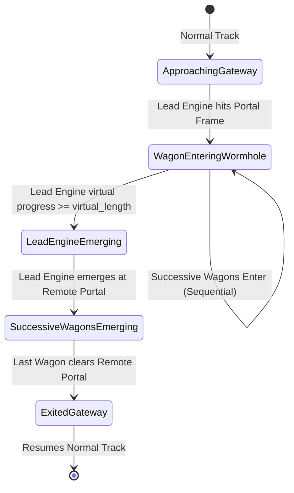

# OpenSpaceTTD: Game Design & Technical Planning Specification
**Commonwealth-Scale Interplanetary Logistics on OpenTTD**

---

## A. Current State

OpenSpaceTTD is an operational OpenTTD fork with the single-map planetary slice and federation work through Sprint 22 implemented. Sprint 23 reconciled the roadmap and fixed the next delivery sequence. Alien art, blueprints, CST prefabs and the consolidated UAT release remain planned work.

### Established Codebase Assets
- **Engine Baseline:** Upstream OpenTTD compiled with full optional library support (SDL2, OpenGL, FreeType, Fontconfig, HarfBuzz, ICU, PNG, ZLIB, LZMA, LZO, CURL, FluidSynth, OpusFile, Soxr).
- **Test Inventory:** The configured build currently registers 207 CTest cases. Historical per-sprint pass counts remain in their sprint reports; rerun the full suite for release evidence.
- **Core Repository Rules (`AGENTS.md`):** Strict preservation of `TileIndex`, single 2D coordinate space, deterministic simulation, and wormhole-derived portal architecture.
- **Initial Prototype (`src/portal/`):**
  - `PortalRegistry` implemented in `src/portal/portal_registry.h` / `src/portal/portal_registry.cpp`.
  - Strong typedefs `WorldID`, `PortalID`, and endpoint structures in `src/portal/portal_type.h`.
  - Engine hooks in `GetOtherTunnelBridgeEnd()`, `GetOtherTunnelEnd()`, and `GetTunnelBridgeLength()` in `src/tunnelbridge_map.h`, `src/tunnel_map.cpp`, and `src/tunnelbridge.h`.
  - Catch2 unit test suite in `src/tests/test_portal_wormhole.cpp` verifying O(1) resolution, non-colinear cross-world pairing, and YAPF `CFollowTrackRail` leap traversal.

---

## B. Spike Findings: Proven Capabilities & Remaining Constraints

### 1. What the Spike Proved
1. **Wormhole Decoupling:** OpenTTD's native `Track::Wormhole` and `VehicleEnterTileState::EnteredWormhole` state machine cleanly decouples traversing vehicles from intermediate map grid tiles without breaking game loop invariants.
2. **Arbitrary Coordinate Pairing:** Replacing the linear raycasting algorithm (`GetOtherTunnelEnd()`) with `PortalRegistry` enables instantaneous O(1) resolution of arbitrary, diagonal, non-colinear endpoints across disparate world coordinates.
3. **Seamless Pathfinder Traversal:** YAPF's `CFollowTrackT::FollowTileExit()` automatically transitions from the entry portal to the exit portal in another world and assigns `tiles_skipped = virtual_length`.
4. **Natural Path Routing Penalty:** YAPF rail cost (`yapf_costrail.hpp`) multiplies `tiles_skipped * YAPF_TILE_LENGTH`, naturally giving wormholes realistic routing penalties and transit delay calculations without bespoke pathfinder forks.
5. **Zero Regression:** Engine hooks integrated into OpenTTD's map accessors without breaking any existing tunnel, bridge, or regression test cases.

### 2. Discovered Constraints & What Remains Uncertain
1. **Consist Euclidean Continuity (`CheckTrainsLengths`):**
   - *Constraint:* In `src/train_cmd.cpp`, `TrainController()` and `CheckTrainsLengths()` enforce that each trailing vehicle in a consist is positioned at `std::max(abs(u->x_pos - w->x_pos), abs(u->y_pos - w->y_pos)) == u->CalcNextVehicleOffset()`.
   - *Impact:* When a multi-wagon train transits an inter-world portal, leading wagons appear at World 1 coordinates while trailing wagons are still at World 0 coordinates.
   - *Safe Assumption:* Wagons inside `Track::Wormhole` must be treated as transitioning through a virtual portal segment, decoupling Euclidean coordinate checks between vehicles separated by a wormhole boundary.
2. **Physical Coordinate Advancement in Wormhole:**
   - *Constraint:* In standard OpenTTD, `GetNewVehiclePos(v)` increments `x_pos, y_pos` along the vector between tunnel portals.
   - *Safe Assumption:* Vehicles in an interplanetary portal must not step across intervening void or third-party world tiles. Instead, vehicles in `Track::Wormhole` must advance along a 1D virtual progress counter ($0 \dots \text{virtual\_length}$) and teleport directly to the destination portal tile coordinates upon arrival.
3. **State Transition Caching:**
   - *Constraint:* During a multi-tick consist crossing, game state (such as portal pairing or signal reservations) could theoretically mutate.
   - *Safe Assumption:* The assigned exit endpoint, exit trackdir, and transit length must be cached on the consist's lead vehicle upon entering the gateway to guarantee deterministic transit across all wagons.
4. **Save/Load Persistence:**
   - *Constraint:* `PortalRegistry` is currently in-memory.
   - *Safe Assumption:* Savegame chunk `CHUNK_PORT` must serialize registered portals, endpoint coordinates, and active consist transit states.

---

## C. Target Game Loop

The experience of OpenSpaceTTD is centered around building an interplanetary railway empire where raw frontiers feed emerging processors, which in turn supply hungry core metropolises.

### 10-Minute Experience (Opening the Frontier)
- The player starts on **World 1 (Phase 3 - Frontier)**.
- Land is cheap, distances are large, and natural resources (bio-crops, raw ores) are abundant.
- The player lays out a heavy diesel or conventional electric railway linking an expansive Bio Farm to a local frontier settlement and an ancient, inactive **Gateway Gate**.
- The player dispatches their first freight train. Upon reaching the gateway, the train enters the wormhole and emerges on **World 2 (Phase 2 - Developed)**, delivering grain to a Food Processing Plant.
- Immediate cash injection and visual satisfaction of seeing a single continuous train order connect two distinct worlds.

### 1-Hour Experience (Interplanetary Supply Chains & Network Congestion)
- The player has established a two-gateway corridor: **Phase 3 (Frontier) $\rightarrow$ Phase 2 (Processing) $\rightarrow$ Phase 1 (Core)**.
- Grain and protein from Phase 3 are refined into packaged food on Phase 2, then loaded onto high-speed freight consists and hauled into the dense, towering megalopolis of Phase 1.
- **Congestion emerges at the Gateways:** Single-track portal bottlenecks cause train queues. The player must expand portal throat junctions, upgrade approach signalling with Path-Based Signalling (PBS), and build grade-separated flyovers.
- The player unlocks high-speed passenger services between Phase 2 and Phase 1 to capture high-margin passenger revenue.

### Late-Game Experience (Civilisation-Scale Logistics & Expansion)
- The player manages a massive network of 4–6 worlds.
- Core worlds consume colossal volumes of advanced goods and produce specialized capital machinery and colony supplies.
- The player funds the opening of **Phase 4 Expansion Worlds** (untamed wilderness with rich resource deposits).
- The player constructs ultra-high-capacity vacuum tube railways and multi-megawatt freight corridors feeding thousands of tons per minute into orbital and metropolitan distribution centers.

---

## D. World/Phase Model

### 1. Separation of Phase and Biome
- **Phase (Socio-Economic Development):** Governs population density, urban sprawl, industrial role, and allowable infrastructure/depot construction.
- **Biome (Environmental Character):** Governs ground tiles, foliage, terrain roughness, and tree growth (independent of phase).
- *Example:* A Phase 3 frontier world can be Temperate (vast green plains and mega-farms), Arid (harsh desert mining colony), or Boreal (frozen timber frontier).

```
+--------------------------------------------------------------------------+
|                            WORLD REGION MATRIX                           |
+-------------------+------------------------------------------------------+
| Dimension         | Properties                                           |
+-------------------+------------------------------------------------------+
| Phase 1 (Core)    | Metropolitan, High Density, Pure Consumer / Hi-Tech  |
| Phase 2 (Emerging)| Industrial Towns, Refineries, Processing, Mixed Rail |
| Phase 3 (Frontier)| Resource Extraction, Bio-Farms, Heavy Freight Rail   |
| Phase 4 (Wild)    | Unsettled Expansion, Survey Sites, Player Colonised  |
+-------------------+------------------------------------------------------+
| Biomes (Any Phase)| Temperate, Arid/Desert, Sub-Arctic, Volcanic/Barren  |
+-------------------+------------------------------------------------------+
```

### 2. World Phase Definitions

#### Phase 1: Core Worlds (e.g. Earth, Oaktree, Augusta)
- **Visuals:** Concrete, glass, multi-level megalopolises, heavy light pollution, minimal untouched nature.
- **Role:** Immense consumption of food, consumer goods, and energy; exporter of high-tech components, capital equipment, and luxury passengers.
- **Forbidden:** Raw bulk extraction (mines, bio-farms cannot be founded here).
- **Exclusive Assets:** Vacuum tube rail depots, maglev/hyper-speed passenger terminals, high-density distribution centers.

#### Phase 2: Developed / Emerging Worlds (e.g. Merredin, Clonclurry)
- **Visuals:** Modern suburban and industrial architecture, sprawling rail yards, highway/track corridors cutting through mixed countryside.
- **Role:** The industrial backbone. Imports raw ores and agricultural commodities; processes them into refined alloys, machine parts, and packaged foods; exports to Phase 1.
- **Assets:** High-power electric freight, modern intermodal depots, intermediate processing plants.

#### Phase 3: Frontier Worlds (e.g. Calyx, Far Away)
- **Visuals:** Vast open terrain, prefabricated modular towns, colossal bio-domes, open-cut strip mines, unpaved tracks.
- **Role:** High-volume primary resource extraction. Low population, low local consumption, total export dependency.
- **Assets:** High-efficiency diesel/electric heavy haulers, bulk hopper infrastructure, raw resource loading loops.

#### Phase 4: Expansion / Unsettled Worlds
- **Visuals:** Untouched planetary wilderness, dormant gateway structure, zero initial settlements.
- **Mechanic:** Player funds gateway reactivation or delivers initial colony modules, founding the first outpost and starting the transformation into Phase 3.

---

## E. Technical Architecture: Multi-World on One Map

```
+-------------------------------------------------------------------------------+
|                      4096 x 4096 PHYSICAL TILEMAP SPACE                       |
+---------------------------------------+---------------------------------------+
| WORLD 0: Phase 1 Core (1024x1024)     | WORLD 1: Phase 2 Emerging (1024x1024) |
| [TileX: 0..1023, TileY: 0..1023]      | [TileX: 2048..3071, TileY: 0..1023]   |
|                                       |                                       |
|  (Megacities, High-Tech Hubs)         |  (Refineries, Processing Plants)      |
|                      [Gateway 0A]====(Wormhole)====[Gateway 1A]               |
+ - - - - - - - - - - - - - - - - - - - + - - - - - - - - - - - - - - - - - - - +
|               VOID BUFFER ZONE (TileType::Void, Width: 1024 Tiles)            |
+ - - - - - - - - - - - - - - - - - - - + - - - - - - - - - - - - - - - - - - - +
| WORLD 2: Phase 3 Frontier (1024x1024) | WORLD 3: Phase 4 Wilderness (1024x1024)|
| [TileX: 0..1023, TileY: 2048..3071]   | [TileX: 2048..3071, TileY: 2048..3071]|
|                                       |                                       |
|  (Bio-Farms, Deep Ore Mines)          |  (Unexplored Natural Resources)       |
|                      [Gateway 2A]====(Wormhole)====[Gateway 1B]               |
+---------------------------------------+---------------------------------------+
```

### 1. Spatial Partitioning Without Modifying `TileIndex`
- Map size: 2048×2048 or 4096×4096 contiguous tile grid.
- Each world occupies a discrete $W_x \times W_y$ coordinate block.
- Worlds are separated by a minimum 64-tile buffer band set to `TileType::Void` via `MakeVoid()`. This prevents road pathfinding, town sprawl, or terraforming bleed between worlds.

### 2. O(1) Planet Region Lookup
To avoid per-tick coordinate scans:
```cpp
class PlanetManager {
public:
    static WorldID GetTileWorld(TileIndex tile);
    static const PlanetRegion *GetRegion(WorldID world);
    static const PlanetRegion *GetRegionByTile(TileIndex tile);
    static bool CanBuildAssetOnWorld(AssetType type, uint32_t asset_id, WorldID world);
};
```
- Tile-to-World mapping is indexed via a 2D spatial lookup grid (64×64 tile macro-chunks) giving strict $O(1)$ constant time lookup.
- Towns, industries, and stations cache their `WorldID` on creation.

---

## F. Gateway Architecture & Train Traversal

### 1. Explicit Portal Registry (`PortalRegistry`)
- Wormhole portal heads are paired in an explicit lookup table (`PortalLink`).
- Portal heads are placed as specialized rail tiles (reusing and extending `TileType::TunnelBridge`).
- Supports arbitrary orientation: Entrance A facing NE can link to Exit B facing SE.
- Provides configurable `virtual_length` (e.g. 20–50 virtual tiles) representing transit time through the wormhole.

### 2. Multi-Wagon Consist Traversal & Distance Decoupling


- **Consist Integrity Rule:** In `src/train_cmd.cpp`, `CheckTrainsLengths()` is updated:
  ```cpp
  if (u->track == Track::Wormhole || w->track == Track::Wormhole) {
      /* Wagons crossing a portal wormhole boundary are decoupled from spatial Euclidean checks */
      continue;
  }
  ```
- **Virtual Advancement:** When a wagon has `track == Track::Wormhole`:
  - It does not step along spatial $(x, y)$.
  - It advances internal progress counter `wagon->wormhole_progress += speed`.
  - When `wagon->wormhole_progress >= portal->virtual_length`, it teleports to the remote portal tile coordinates, resets `VehState::Hidden`, and resumes standard sub-tile frame motion.

### 3. Signalling & PBS Reservations
- Gateways support Path-Based Signalling (PBS).
- Reserving a path into a gateway sets `SetTunnelBridgeReservation(entry_tile, true)` and extends across the wormhole to reserve `SetTunnelBridgeReservation(exit_tile, true)`.
- Standard block signals or PBS signals can be placed directly on the gateway approach and exit tracks.

---

## G. Economy & Industry Design: Cross-World Supply Chains

### 1. Comparative Advantage Chains
```
[PHASE 3: FRONTIER]           [PHASE 2: EMERGING]            [PHASE 1: CORE]
====================          ====================           ===============
Bio-Farm                      Food Processing Plant          Metropolitan Market
  ├── Grain ────────(Gate)───►  ├── Packaged Food ──(Gate)──►  (High-Value Urban
  └── Biomass ──────(Gate)───►  │                              Consumption)
                                │
Deep Ore Mine                 Smelter & Foundry              Advanced Electronics
  ├── Iron Ore ─────(Gate)───►  ├── Steel & Alloys ─(Gate)──►  & Nanotech Fab
  └── Rare Minerals ─(Gate)──►  └── Machine Parts ──(Gate)──►  (Capital Goods)
                                                                 │
                                                               (Gate)
                                                                 │
Colony Supply Depot ◄────────────────────────────────────────────┘
  (Consumes Capital Goods to trigger settlement expansion)
```

### 2. Cargo Demand & Revenue Scaling
- Cargo delivered across portals receives an **Interplanetary Transit Bonus**:
  $$\text{Revenue} = \text{BaseRate}(\text{cargo}, \text{time}) \times \left(1.0 + 0.5 \times \Delta\text{Phase}\right)$$
  Delivering raw goods from Phase 3 directly or via processors to Phase 1 yields premium revenue, incentivizing long-distance network construction.
- CargoDist natively integrates: passengers and mail generate cross-world travel demand between frontier colonies and the core world.

---

## H. Rail & Technology Design

### 1. Technological Specialisation by World Role
| Rail Tier | Dominant World | Characteristics | Key Consists |
|---|---|---|---|
| **Tier 1: Heavy Conventional** | Phase 3 (Frontier) | Robust, low maintenance, high tractive effort, handles rough terrain. | Bulk Hoppers, Heavy Diesels, Ore Haulers |
| **Tier 2: High-Power Electric** | Phase 2 (Emerging) | Fast acceleration, high throughput, moderate running cost. | Fast Intermodal, Multi-Unit Freight, Regional EMUs |
| **Tier 3: Maglev / Vacuum Rail** | Phase 1 (Core) | Extreme speed (400+ km/h), ultra-high capacity, high infrastructure cost. | Super-Express Passenger EMUs, High-Speed Logistics |

### 2. Build Location Restrictions vs. Operating Freedom
- **Depots:** A Tier 3 Vacuum Depot can *only* be constructed on a Phase 1 world (`CmdBuildTrainDepot` validates `planet.phase == Phase1`).
- **Through-Running:** Once built, a train can run anywhere its track is laid! If the player builds compatible electrified track through gateways into Phase 2 or Phase 3, the Tier 3 train can cross freely.
- **Industries:** Bio-Farms cannot be founded on Phase 1 worlds (`CmdBuildIndustry` rejects placement).

---

## I. NewGRF Strategy & Content Pack

### 1. Survey of Candidate Foundations
- **FIRS Industry Replacement Set (GPL v2):** Written in NML. Cleanly modularized with extraction, processing, and consumption economies. Ideal baseline for custom OpenSpaceTTD cargo chains.
- **Iron Horse / OpenGFX+ Trains (GPL v2):** Comprehensive, beautifully balanced train sets in NML with distinct visual eras. Can be forked/adapted for Phase 2/3 rolling stock.
- **2CC / Maglev / Vac Sets (GPL v2):** Provides high-speed passenger and logistics sprites for Phase 1.

### 2. OpenSpaceTTD Cohesive Content Architecture
Instead of loading 15 disparate NewGRFs with clashing art styles and conflicting economics, OpenSpaceTTD will maintain a dedicated, curated in-tree content package:
- `assets/grf/openspacettd_industries.grf`: Custom planetary industry and cargo chains.
- `assets/grf/openspacettd_rail.grf`: Specialized rolling stock and catenary/vac infrastructure.
- Compiled via standard `nml` or bundled directly as default base GRF overrides.

---

## J. Art Direction: Distinct Planetary Identities

```
+--------------------------------------------------------------------------+
|                         ART DIRECTION GUIDELINES                         |
+-------------------+------------------------------------------------------+
| World Phase       | Visual Aesthetic & Architecture                      |
+-------------------+------------------------------------------------------+
| Phase 1: Core     | Neo-metropolitan: polished metals, dark glass, neon, |
|                   | elevated maglev guides, dense multi-tile buildings,  |
|                   | terraformed plazas, minimal unpaved ground.          |
+-------------------+------------------------------------------------------+
| Phase 2: Developed| Near-future industrial: concrete, catenary arches,   |
|                   | container yards, modern mid-rise towers, factory     |
|                   | smokestacks, paved logistics parks.                  |
+-------------------+------------------------------------------------------+
| Phase 3: Frontier | Modern utilitarian colony: modular dome structures,  |
|                   | corrugated alloys, dust roads, sprawling bio-domes,  |
|                   | vibrant natural biomes (grass, red sand, or ice).    |
+-------------------+------------------------------------------------------+
```

---

## K. Technical Decision Matrix

| Subsystem / Feature | NewGRF | GameScript | Mapgen | Core Fork | Art Assets | Spike Req? |
|---|:---:|:---:|:---:|:---:|:---:|:---:|
| **Planet Regions & Metadata** | | | | **X** | | No (Planned) |
| **Portal Endpoint Registry** | | | | **X** | | **DONE** |
| **Consist Portal Traversal** | | | | **X** | | **Yes (Spike 2)** |
| **Cross-World Build Restrictions** | | | | **X** | | No |
| **World Region Map Generation** | | | **X** | **X** | | No |
| **Cargo Chains (Grain, Ore, Alloys)** | **X** | | | | **X** | No |
| **Interplanetary Revenue Bonus** | | | | **X** | | No |
| **Phase 1-3 Rolling Stock & Depots** | **X** | | | **X** | **X** | No |
| **Planet Info UI / Viewport Title** | | | | **X** | | No |
| **World Colonisation (Phase 4)** | | **X** | | **X** | | No |

---

## L. Minimum Playable Vertical Slice

The vertical slice is the tightest possible end-to-end demonstration answering:
*«"Does interplanetary OpenTTD create a fundamentally better logistics game?"»*

### Scope
- **1 Map (1024×512 tiles):**
  - **World 1 (Phase 3 - Frontier "Calyx"):** Temperate bio-plains. Contains 1 Bio-Farm and 1 Ore Mine.
  - **World 2 (Phase 2 - Emerging "Merredin"):** Industrial hills. Contains 1 Food Processor and 1 Smelter.
  - **World 3 (Phase 1 - Core "Oaktree"):** High-density metropolis. Contains 1 Metropolitan Market and 1 Advanced Fab.
- **2 Gateways:**
  - Gateway Alpha: Calyx (P3) $\longleftrightarrow$ Merredin (P2).
  - Gateway Beta: Merredin (P2) $\longleftrightarrow$ Oaktree (P1).
- **2 Playable Cargo Loops:**
  1. Bio-Farm $\rightarrow$ Rail $\rightarrow$ Gateway Alpha $\rightarrow$ Food Processor $\rightarrow$ Rail $\rightarrow$ Gateway Beta $\rightarrow$ Metropolitan Market.
  2. Ore Mine $\rightarrow$ Rail $\rightarrow$ Gateway Alpha $\rightarrow$ Smelter $\rightarrow$ Rail $\rightarrow$ Gateway Beta $\rightarrow$ Advanced Fab.
- **Build Restrictions Enforced:** Player cannot build a Bio-Farm in Oaktree; player cannot build a Tier 3 Depot in Calyx.
- **Through-Running Verified:** A freight train loaded at Calyx travels continuously through both gateways to deliver finished goods to Oaktree.

---

## M. Implementation Roadmap: Narrow, Vibe-Code Sprints

```
[Spike 2: Consist Wormhole Traversal]
               │
               ▼
[Sprint 1: Planet Region Foundation]
               │
               ▼
[Sprint 2: Cross-World Placement Restrictions]
               │
               ▼
[Sprint 3: End-to-End Consist Portal Traversal]
               │
               ▼
[Sprint 4: Multi-World Map Generation (Void Buffers)]
               │
               ▼
[Sprint 5: Interplanetary Cargo & Industry Slice]
               │
               ▼
[Sprint 6: Planet UI & Viewport Awareness]
               │
               ▼
[Sprint 7: Vertical Slice Playtest & Balancing]
```

### Spike 2: Consist Wormhole Traversal Spike
- **Goal:** Verify that a multi-wagon consist can enter a non-contiguous portal, traverse it without Euclidean length errors, and emerge intact at the remote portal head.
- **Files:** `src/train_cmd.cpp`, `src/tests/test_consist_portal.cpp`.
- **Exit Criteria:** Catch2 test asserting a 5-wagon train crosses from $(10, 10)$ to $(1000, 1000)$ with valid consist spacing upon exit.

### Sprint 1: Planet Region Foundation
- **Goal:** Engine internally recognizes `PlanetRegion` data structures and maps every tile to a world in $O(1)$ time.
- **Player Outcome:** Developer commands can query which world any tile belongs to.
- **Files:** `src/portal/planet_type.h`, `src/portal/planet_manager.h`, `src/portal/planet_manager.cpp`.
- **Tests:** Unit tests asserting tile-to-world mapping across 4 world bounds.

### Sprint 2: Cross-World Placement Restrictions
- **Goal:** Disallow building illegal industries or depots based on world phase.
- **Player Outcome:** Placing a Bio-Farm in Phase 1 shows red error: "Cannot construct this industry on a Core World".
- **Files:** `src/industry_cmd.cpp`, `src/rail_cmd.cpp`, `src/depot_cmd.cpp`.
- **Tests:** `CmdBuildIndustry` and `CmdBuildTrainDepot` unit tests asserting success on Phase 3 and rejection on Phase 1.

### Sprint 3: End-to-End Consist Portal Traversal
- **Goal:** Integrate Spike 2 consist handling into standard game loop.
- **Player Outcome:** Trains execute orders passing through gateways across worlds in live gameplay.
- **Files:** `src/train_cmd.cpp`, `src/tunnelbridge_cmd.cpp`.
- **Tests:** Simulation regression test running a live train through a gateway.

### Sprint 4: Multi-World Map Generation
- **Goal:** Map generator generates 3 distinct worlds separated by void buffers.
- **Player Outcome:** "New Game" generates 3 isolated worlds with pre-linked gateway structures.
- **Files:** `src/genworld.cpp`, `src/tgp.cpp`, `src/portal/world_gen.cpp`.
- **Tests:** Headless generation test verifying void buffers and gateway connectivity.

### Sprint 5: Interplanetary Cargo & Industry Slice
- **Goal:** Introduce the vertical slice cargo chain (Grain $\rightarrow$ Food Processor $\rightarrow$ Market).
- **Player Outcome:** Complete profitable logistics loop connecting Phase 3 to Phase 1.
- **Files:** `src/table/cargotype.h`, `src/table/industrytype.h` (or base GRF).
- **Tests:** End-to-end cargo delivery test asserting revenue payment.

### Sprint 6: Planet UI & Viewport Awareness
- **Goal:** Display current planet name, phase, and imports/exports on the top toolbar and town windows.
- **Player Outcome:** Player always knows which world they are viewing and inspecting.
- **Files:** `src/toolbar_gui.cpp`, `src/statusbar_gui.cpp`, `src/viewport_gui.cpp`.
- **Tests:** GUI window test validating planet title rendering.

---

## N. Test Strategy

1. **Automated Unit Tests (`openttd_test`):**
   - Tile $\rightarrow$ correct `WorldID`.
   - `CanBuildAssetOnWorld` validation matrices.
   - Consist distance check overrides during `Track::Wormhole`.
   - Gateway pairing and unregistration invariants.
2. **Regression Suite (`ctest`):**
   - All 103 baseline tests must continue to pass on every commit.
3. **Headless Integration Tests:**
   - Dedicated headless mode (`./build/openttd -D -g`) running a deterministic 1000-tick script with trains traversing gateways.

---

## O. Risks & Unknowns

| Risk | Severity | Mitigation Strategy |
|---|:---:|---|
| **Consist Teleportation Desync in Multiplayer** | **HIGH** | Pin lead vehicle's exit tile and tick trajectory into a deterministic transit cache shared across network frames. |
| **Viewport Jumping Disorientation** | **MEDIUM** | Provide smooth viewport snap or bookmark shortcuts for jumping between planetary hubs. |
| **Pathfinder CPU Overhead across Gateways** | **LOW** | Proven by Spike 1: YAPF evaluates gateway hops as single segment leaps (`tiles_skipped`), adding near-zero node search overhead. |
| **NewGRF Visual Inconsistency** | **MEDIUM** | Restrict the vertical slice to a curated internal content set rather than loading unverified third-party packs. |

---

## P. Required Additional Spikes

### Spike 2: Multi-Wagon Consist Wormhole Traversal
- **Why Needed:** Before executing full gameplay sprints, we must prototype the exact consist following logic in `src/train_cmd.cpp` so multi-vehicle trains do not trigger `STR_BROKEN_VEHICLE_LENGTH` when their wagons span across an interplanetary portal.
- **Estimated Scope:** ~100 lines of test and decoupled distance logic.

---

## Q. Parking Lot (Explicitly Excluded from Near-Term Scope)

- Space combat or planetary defense.
- Off-rail space vessels or free-flight mechanics.
- Complex electrical grid / power pole simulation.
- Procedural alien language generation.
- Dynamic climate change / planetary terraforming simulation.
---

## S. Long-Term Roadmap: EPIC — Federated Multi-Server Universe

The implemented federation architecture and handoff state are documented in the Sprint 14–17 specifications in this directory and the current delivery audit in [SPRINT23_SCOPE_ART_AND_UAT_AUDIT_2026-09-13.md](SPRINT23_SCOPE_ART_AND_UAT_AUDIT_2026-09-13.md).

```text
Current Sprints (1-13)       Federation Prep             Federation Prototype        Persistent Universe          Megacity Economy
┌──────────────────────┐    ┌─────────────────────┐    ┌──────────────────────┐    ┌─────────────────────┐    ┌──────────────────────┐
│ Single-Map           │    │ Stable Global IDs   │    │ 2-Server Handoff     │    │ Persistent Player   │    │ Dedicated Phase 1    │
│ Planetary Regions    │───>│ Consist Streamer    │───>│ Spike                │───>│ Accounts & Corporate│───>│ Core Worlds          │
│ Wormhole Architecture│    │ Content Manifests   │    │ Universe Authority   │    │ Directory           │    │ Megacity Multi-World │
│ Local Economy        │    │ Local/Global Split  │    │ Proof of Concept     │    │ Global Commodity    │    │ Logistics Networks   │
└──────────────────────┘    └─────────────────────┘    └──────────────────────┘    └─────────────────────┘    └──────────────────────┘
```

### Phase F1: Federation Preparation (Architectural Decoupling) — **COMPLETE**
- **Goal:** Ensure near-term single-map codebase avoids blocking multi-server serialization.
- **Completed Deliverables (Sprints 12–14):**
  - [x] Persistent 128-bit `FederationNamespace` and `GlobalConsistID` lifecycle tracking (`FIDS` savegame chunk).
  - [x] Globally unique identifier schemas: `GlobalCompanyID`, `GlobalStationID` (with `WorldID` world attribution), `GlobalCargoSourceID` (provenance tracking), and `GlobalOrderDestinationID` (cross-world routing).
  - [x] Canonical `UniverseContentManifest` with BLAKE2b-256 tokens and strict configuration admission diagnostics.
  - [x] Consist Snapshot wire format v2 with cargo provenance resolution, goto order preservation, and v1 dual-version backward compatibility.
  - [x] Full automated test coverage (100% CTest pass rate, 0 regressions). Codebase is verified and ready for Phase F2 / P2.

### Phase F2: Federation Prototype (Technical Spike) — **COMPLETE**
- **Goal:** Implement a 2-server handoff proof-of-concept.
- **Completed Deliverables (Sprint 15):**
  - [x] Authoritative `Universe Authority` daemon (`scripts/universe_authority.py`) and C++ engine client (`src/portal/universe_authority.h`, `src/portal/universe_authority.cpp`).
  - [x] Inter-server portal gate registrations (`RegisterInterServerPortal`) and pathfinder boundary exit routing (`src/portal/portal_registry.cpp`, `src/pathfinder/follow_track.hpp`).
  - [x] Consist despawn (`ConsistMaterializer::DespawnForTransfer`) with clean reservation release and vehicle destruction.
  - [x] Consist emergence & materialization (`ConsistMaterializer::MaterializeFromTransfer`) with manifest validation, throat obstruction clearance, consist topology restoration, dynamics preservation, cargo packet reconstruction, and PBS tunnel reservation acquisition.
  - [x] Multi-process integration spike test script (`scripts/test_two_server_federation.py`) and Catch2 test suite (`src/tests/test_federation_transfer.cpp`).
  - [x] Strict commodity conservation invariant enforcement ($\sum \text{Cargo}_{\text{Init}} = \sum \text{Cargo}_{\text{Done}} + \sum \text{Cargo}_{\text{Transit}}$) with zero loss and zero duplication.


### Phase F3: Persistent Universe & Corporate Ledger — **COMPLETE**
- **Goal:** Multi-server persistent universe infrastructure.
- **Completed Deliverables (Sprint 16):**
  - [x] Persistent player account authentication and session token management (`GlobalPlayerID`, `PlayerAccount`, `FederationPlayerRegistry`).
  - [x] Multi-world corporate ownership and chartering (`CorporateCharter`, `GlobalCompanyID`, `AuthorizeDelegate`, `RegisterWorldPresence`).
  - [x] Dynamic world server discovery directory with real-time heartbeat monitoring, phase filtering, and stale world timeout handling.
  - [x] Per-cargo-type detailed commodity conservation ledger verifying zero duplication across individual commodity types ($\sum \text{Cargo}_{\text{Init}}(c) = \sum \text{Cargo}_{\text{Done}}(c) + \sum \text{Cargo}_{\text{InTransit}}(c)$).
  - [x] Inter-world trade balance accounting tracking bilateral cargo export/import volumes and transport valuation credits.
  - [x] In-engine console commands (`universe_auth`, `universe_worlds`, `universe_company`, `universe_trade`).
  - [x] Full test coverage: Catch2 persistent universe test suite (`src/tests/test_federation_persistent_universe.cpp`), 182/182 CTests passing, and Python end-to-end integration spike (`scripts/test_f3_persistent_universe.py`).

### Phase F4: Megacity & Empire Economy
- **Status:** Complete (Sprint 17)
- **Goal:** Scale individual Phase 1 Core Worlds to dedicated max-size (4096×4096) servers, with sustained multi-tier commodity demand, high-throughput freight corridor congestion management, and empire-wide supply chain matrix tracking.
- **Completed Deliverables:**
  - [x] Megacity sustained commodity demand mechanics with three demand tiers: Tier 1 Sustenance ($P / 20$), Tier 2 Expansion ($P / 40$), Tier 3 Prosperity ($P / 100$).
  - [x] Cyclical monthly supply evaluation driving metropolitan growth states: Starvation ($0.0\times$), Subsistence ($1.0\times$), MetropolitanBoom ($1.5\times$), and HyperGrowth ($2.0\times$).
  - [x] High-throughput freight corridor capacity limits (`max_bandwidth_trains_per_min`, `max_active_in_transit`) with dynamic transit delay scaling across congestion tiers (Clear $1.0\times$, Moderate $1.2\times$, Congested $1.5\times$, Saturated $2.0\times$).
  - [x] Quality of Service (QoS) priority mitigation: Express and PriorityUrgent freight shipments receive 50% delay penalty relief during corridor congestion.
  - [x] Multi-planet empire supply chain matrix aggregating macro-phase transitions (Phase 3 $\to$ 2, Phase 2 $\to$ 1, Phase 3 $\to$ 1, Core exports) and interplanetary tariff accounting ($10$ Cr/unit).
  - [x] In-engine console administration commands (`universe_corridors`, `universe_megacity`, `universe_economy`).
  - [x] Universe Authority daemon REST endpoints (`/corridors/*`, `/megacity/*`, `/economy/*`).
  - [x] Full test verification: Catch2 suite (`src/tests/test_federation_megacity_economy.cpp`), 185/185 CTests passing (100%), and Python end-to-end integration test (`scripts/test_f4_megacity_economy.py`).

---

## T. Delivery Status and Roadmap (Sprints 18–29)

For detailed scope, see [SPRINT23_SCOPE_ART_AND_UAT_AUDIT_2026-09-13.md](SPRINT23_SCOPE_ART_AND_UAT_AUDIT_2026-09-13.md), [ALIEN_WORLD_ART_DIRECTION.md](ALIEN_WORLD_ART_DIRECTION.md), [FEATURE_UI_UAT_COVERAGE.md](FEATURE_UI_UAT_COVERAGE.md) and [COMMONWEALTH_LORE_AND_ASSET_ALIGNMENT.md](COMMONWEALTH_LORE_AND_ASSET_ALIGNMENT.md).

### 1. Canonical Nomenclature Standard
- **World / WorldID:** Logical world entity / server instance (`WorldID`).
- **Planet Region:** Coordinate bounding box on the 4096×4096 physical map (`PlanetRegion`, `PlanetManager`).
- **World Phase:** Development tier (`Phase1_Core` .. `Phase4_Expansion`).
- **Portal Gate:** Physical track structure (`CmdBuildPortalGate`).
- **Portal Link:** Intra-map wormhole pair (`PortalLink`).
- **Freight Corridor:** Inter-server federation route (`InterServerRoute`, `FreightCorridor`).
- **Universe Authority:** Interstellar transaction and identity coordinator (`UniverseAuthorityService`).
- **Megacity:** Core world metropolis tracking 3-tier sustained commodity quotas (`MegacityManager`).

### 2. Commonwealth Traction & Asset Gradient
- **Phase 3 (Frontier):** Rugged Pioneer Steamers (Coal/Wood) and Heavy Planetary Diesels hauling raw biomass, minerals, and timber over un-electrified terrain.
- **Phase 2 (Developed / Refinery):** High-Voltage Overhead Catenary Electrics hauling intermodal containers, superalloys, and synthetic chemicals.
- **Phase 1 (Core Megacity):** CST Vacuum-Tube Maglevs (vactrains) traveling at 400–1,000+ km/h through subterranean and arcology guideways.

### 3. Reconciled status through Sprint 23

- **Sprint 18 — Complete:** Native Megacity Overview, Freight Corridor Monitor and Universe Directory windows.
- **Sprint 19 — Complete:** Configurable cluster supervisor, topology bootstrap and health/recovery integration coverage.
- **Sprint 20 — Complete:** Spaceport and Edge Conduit federation routing with supply-chain attribution.
- **Sprint 21 — Partially complete:** Gateway telemetry/navigation and Commonwealth string alignment shipped. The proposed alien art and in-tree NewGRF packs did not ship and move into Sprints 24 and the content backlog.
- **Sprint 22 — Complete:** Round-trip consist order restoration and autonomous federation scheduling.
- **Sprint 23 — Complete:** Scope reconciliation, alien art specification, UI coverage audit and UAT delivery plan.
- **Sprint 24 — Complete:** Playable alien worlds foundation with procedural multi-world environmental stylization (Temperate Core, Arid Industrial, Sub-Arctic Frontier), O(1) spatial biome resolution, and CST monumental portal gate visuals.
- **Sprint 25 — Complete:** Player Rail Blueprints with map capture, persistent library, portable JSON serialization, 90°/180°/270° rotation, horizontal reflection, deterministic server-authoritative placement command (`Commands::PlaceBlueprint`), and rail toolbar GUI.
- **Sprint 26 — Complete:** Eight canonical CST Prefab Rail Blocks shipped through the blueprint system with RHD/LHD traffic-side invariance, embedded operating guidance, read-only builtin protection, and Catch2 test suite.

### 4. Planned delivery sequence

- **Sprint 27 — Complete Feature UI:** Close player and operator UI gaps recorded in the coverage matrix (Supply Chain Matrix & Trade Ledger window, Federation authentication and charter status feedback).
- **Sprint 28 — Guided Solo UAT:** Generate a fresh all-feature save with persistent Story Book goals and reproducible build metadata.
- **Sprint 29 — Federation UAT:** Deliver a live three-server acceptance kit covering round trips, recovery, content admission, telemetry and commodity conservation.
