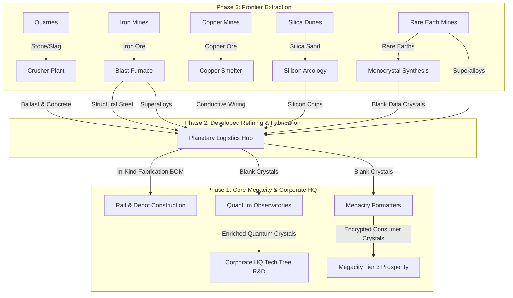
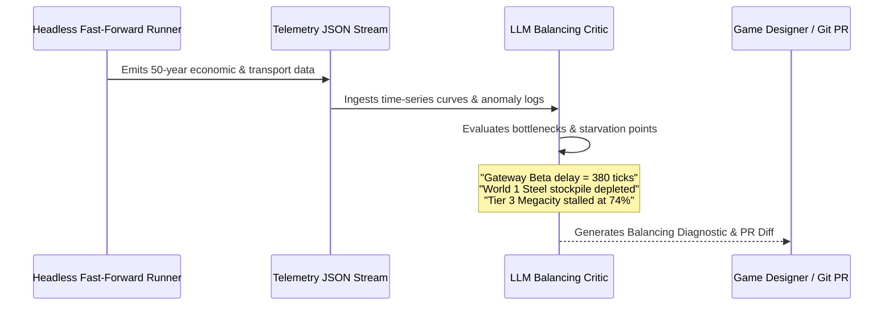

# Architectural Spike: LLM-Driven Lore World Synthesis, In-Game AI CPU Opponents, and Automated Long-Horizon Balancing UAT

**Status:** ARCHITECTURAL & TECHNICAL DESIGN SPIKE  
**Date:** 2026-09-15  
**Context:** Pre-UAT Architecture Planning for OpenSpaceTTD (Sprints 1–42)  
**Inspiration:** Peter F. Hamilton's *Commonwealth Saga* (Ozzie Isaacs / Nigel Sheldon rail hegemony), *Factorio* / *Captain of Industry* closed-loop industrial ecology, and modern autonomous agentic coding/simulation paradigms.

---

## 1. Executive Summary & Vision

OpenSpaceTTD transforms OpenTTD from a regional 20th-century transport simulator into a multi-planetary industrial empire simulation. Through Sprints 1–42, the engine has integrated:
- Multi-world spatial partitioning (up to six 1024×1024 worlds on a 4096×4096 map separated by void boundaries),
- Non-aligned wormhole portal gates (`Track::Wormhole`, `PortalRegistry`) and atomic 18-tile terminal stations,
- A Factorio-scale 12-cargo Commonwealth industrial ecology (Pipelines A–D),
- Planetary company physical stockpiles (`CompanyWorldStockpile`), dedicated logistics hubs (`CompanyLogisticsHub`), and in-kind fabrication Bill of Materials (BOM) construction (`FabricationManager`),
- In-lore Commonwealth Tech Tree research projects (`TechTreeManager`),
- Multi-tier Megacity demands (Tier 1 Sustenance, Tier 2 Expansion, Tier 3 Prosperity), and
- Portable player rail blueprints and eight canonical CST prefab rail blocks (`Commands::PlaceBlueprint`).

### The Challenge
Manually designing, terraforming, building, and scheduling late-game scenarios across 6 worlds, 5 portal gateways, 12 cargo chains, and dozens of scheduled train consists is a labor-intensive endeavor requiring hundreds of hours of manual player input. Furthermore, vanilla OpenTTD's AI opponents (`AIController`) are rudimentary point-to-point pathfinders that possess no awareness of multi-world topology, wormhole gates, multi-stage production pipelines, logistics hubs, or Megacity demands.

### The Objective
This architectural spike establishes a comprehensive plan for **instructing, prompting, and fine-tuning a Large Language Model (LLM)** to act as a **High-Order Creative Director, Autonomous World Architect, and Simulation Balancing Critic**.

```
┌───────────────────────────────────────────────────────────────────────────────────────────────────────┐
│                               THE THREE PILLARS OF THE LLM SPIKE                                      │
├───────────────────────────────────┬───────────────────────────────────┬───────────────────────────────┤
│    1. Lore World Synthesizer      │   2. In-Game AI CPU Opponents     │  3. Automated UAT & Balancing │
├───────────────────────────────────┼───────────────────────────────────┼───────────────────────────────┤
│ • Natural language lore prompt to │ • Pass macro strategies, CST      │ • Fast-forward multi-decade   │
│   fully populated `.sav` world    │   prefabs, and supply chains to   │   headless simulations        │
│ • Deterministic placement of CST  │   in-game CPU corporations        │ • Continuous telemetry on     │
│   prefabs, gates, and factories   │ • Distinct corporate personas     │   stockpiles, transit, cash   │
│ • Active scheduled train fleets   │   (CST, Grand Central, InterWorld)│ • Detect bottlenecks, inflation│
│   with closed supply loops        │ • Multi-world expansion logic     │   and recommend BOM balances  │
└───────────────────────────────────┴───────────────────────────────────┴───────────────────────────────┘
```

---

## 2. The OpenSpaceTTD Mental Model for LLMs

To instruct an LLM reliably without hallucinated geometries or invalid track topologies, the game's mechanics must be represented at the appropriate level of abstraction.

### 2.1 Spatial and Multi-World Mental Model
The LLM does not reason about 16 million individual raw tiles simultaneously. Instead, it operates on a hierarchical spatial representation:

```
+-------------------------------------------------------------------------------+
| OpenSpaceTTD Coordinate Universe: 4096 x 4096 Physical Grid                   |
+-------------------------------------------------------------------------------+
| World 0: Phase 1 Core (Temperate)      - Oaktree Megacity, Corporate HQ Nexus |
| [Tiles: X 2..1021, Y 2..1021]          - High consumer demand, research labs  |
+-------------------------------------------------------------------------------+
| VOID PERIMETER BUFFER (TileType::Void, Width = 64 tiles)                     |
+-------------------------------------------------------------------------------+
| World 1: Phase 2 Developed (Arid)      - Merredin Industrial Arcology         |
| [Tiles: X 2..1021, Y 1086..2105]       - Secondary smelting, fabs, blank mats |
+-------------------------------------------------------------------------------+
| VOID PERIMETER BUFFER (TileType::Void, Width = 64 tiles)                     |
+-------------------------------------------------------------------------------+
| World 2: Phase 3 Frontier (Sub-Arctic) - Calyx Cryo-Extraction Basin          |
| [Tiles: X 2..1021, Y 2170..3189]       - Iron/Copper/Silica/Slag, Observatories|
+-------------------------------------------------------------------------------+
| VOID PERIMETER BUFFER (TileType::Void, Width = 64 tiles)                     |
+-------------------------------------------------------------------------------+
| Worlds 3, 4, 5: Phase 4 Expansion      - Ignis (Volcano), Verdant, Pelagic    |
| [Tiles: X 2..1021, Y 3254..4093]       - Pristine wilderness, colonial outposts|
+-------------------------------------------------------------------------------+
```

1. **Logical World Regions:** Partitioned along the major axis with dedicated `WorldID` ($0 \dots 5$). Coordinates outside world rectangles are immutable `TileType::Void`.
2. **Wormhole Portal Gate Pairs:**
   - Pre-paired portal gateheads (`PortalEndpoint` in `src/portal/portal_registry.h`).
   - Entry into gatehead tile switches train state to `Track::Wormhole` and `VehState::Hidden`.
   - Re-emergence at destination gatehead is $O(1)$, preserving momentum and length regardless of distance or axis orientation.
   - High-capacity 18-tile terminal approaches (`src/portal/portal_terminal.cpp`) manage acceleration, deceleration, and path reservation (`SignalType::PathOneWay`).
3. **Planetary Anchor Towns:** Each world features a canonical anchor town (`Oaktree Core`, `Merredin Industrial`, `Calyx Frontier`, `Ignis Caldera`, `Verdant Canopy`, `Pelagic Reach`) that acts as the municipal and economic heart of the world.

### 2.2 Factorio-Scale Supply Chains & Stockpile Mechanics
The LLM must understand the 12-cargo Commonwealth suite and the 4 interlocking production pipelines established in Sprint 42:



- **Dual Construction Ledger:** Standard cash purchases vs In-Kind Fabrication (`FabricationManager`).
  - Stamping a rail tile or purchasing a train in fabrication mode consumes materials from `CompanyWorldStockpile` and waives 80% of the cash cost.
  - LLM agents must ensure that logistics lines keep `CompanyWorldStockpile` balances above reserve floors before expanding infrastructure.
- **Logistics Hub Buffering:** `CompanyLogisticsHub` captures rail freight deliveries, converts commercial cargo to company inventory, and manages local reserve floors.

### 2.3 The CST Prefab Rail Abstraction
An LLM attempting to place individual rail tiles (`TrackBits::X`, `TrackBits::Upper`, `TrackBits::Left`) frequently suffers from spatial disorientation, missing signals, or broken switches. 

To guarantee 100% topological validity, the LLM utilizes the **8 Canonical CST Prefab Rail Blocks** (`src/blueprint/blueprint_manager.cpp`) stamped via `Commands::PlaceBlueprint`:

| ID | CST Prefab Name | Footprint | Purpose & Operating Characteristics |
|:--:|---|:---:|---|
| 1 | **CST Mainline Double Straight** | 8×2 | High-speed dual-track trunk with mid-span directional path signals. |
| 2 | **CST Dual-Track Passing Siding** | 14×4 | Offline overtaking loop allowing express trains to pass slow freight. |
| 3 | **CST Portal Gate Approach Corridor** | 10×4 | Dual deceleration buffer blocks and emergency crossover loop before gate throat. |
| 4 | **CST High-Speed 3-Way Wye Junction** | 12×12 | Grade-separated triangular junction connecting 3 dual-track corridors with zero crossing conflicts. |
| 5 | **CST 4-Way Compact Roundabout** | 10×10 | Symmetric circular distribution interchange for 4 cardinal corridors. |
| 6 | **CST Ro-Ro 4-Platform Terminal Station** | 12×8 | Roll-On/Roll-Off terminal station eliminating reversal delays and gridlocks. |
| 7 | **CST Industrial Bulk Balloon Loop** | 14×10 | Unidirectional turnaround loop with 2 bulk loading platforms for continuous ore flow. |
| 8 | **CST Depot Maintenance Staging Yard** | 10×6 | Dual-depot service yard with acceleration merge track to avoid mainline disruptions. |

---

## 3. LLM Execution Interfaces: Architecture Evaluation

How does an LLM translate abstract world plans into a functioning OpenSpaceTTD savegame? Three integration paradigms were evaluated:

```
┌────────────────────────────────────────────────────────────────────────────────────────────────────────┐
│                                THREE EXECUTION PARADIGMS COMPARED                                      │
├──────────────────────────┬─────────────────────────────┬───────────────────────────────────────────────┤
│ Option A: Squirrel       │ Option B: Python Admin Port │ Option C: Direct Binary `.sav`                │
│ GameScript Generator     │ Orchestrator                │ Synthesizer                                   │
├──────────────────────────┼─────────────────────────────┼───────────────────────────────────────────────┤
│ • LLM outputs `.nut`     │ • Headless daemon runs with │ • LLM or compiler directly writes             │
│   script executed by     │   admin TCP port 3977       │   compressed binary chunks                    │
│   internal engine VM     │ • External Python script    │   (`MAP`, `VEH`, `STCK`)                      │
│ • 100% deterministic     │   issues commands & queries │ • HIGH RISK: Pointer corruption,              │
│ • Uses existing commands │ • Ideal for live streaming  │   pool ID desync, fragile across              │
│ • Self-contained in save │ • Extra daemon dependency   │   engine versions. (REJECTED)                 │
└──────────────────────────┴─────────────────────────────┴───────────────────────────────────────────────┘
```

### 3.1 Recommended Paradigm: The Two-Stage Hybrid (Python Manifest + GameScript Generator)

The recommended architecture separates **Macro Reasoning** from **Deterministic In-Engine Execution**:

1. **Stage 1 (LLM Macro-Planner in Python):**
   - The LLM receives the lore prompt and generates a strict, validated **World & Logistics Manifest (JSON)**.
   - The manifest specifies world assignments, industrial nodes, corridor connections, prefab placements, rolling-stock orders, and initial stockpile allocations.
   - A lightweight Python compiler validates the JSON against schema invariants before running the engine.

2. **Stage 2 (Headless GameScript Execution & Save Generation):**
   - OpenSpaceTTD runs in headless mode:
     ```bash
     ./build/openttd -D -s -g -c openttd.cfg
     ```
   - A purpose-built GameScript (`bin/game/llm_world_builder/main.nut`) reads the JSON manifest (or a generated Squirrel data table), executes the construction calls using OpenTTD's native `DoCommand` queue, starts the trains, advances the simulation by 30 days to verify stable circulation, and saves the scenario:
     ```squirrel
     GSSaveLoad.Save("saves/Commonwealth_Lore_Expansion.sav");
     ```

### 3.2 Required Script API Extensions (OpenSpaceTTD Extensions)
While OpenTTD provides `GSRail`, `GSStation`, `GSTown`, `GSVehicle`, and `GSOrder`, full multi-world automation requires exposing the new OpenSpaceTTD subsystems to Squirrel scripts:

```cpp
// Architectural addition to src/script/api/
class ScriptPortal : public ScriptObject {
public:
    static bool BuildPortalGate(TileIndex tile, DiagDirection dir);
    static bool LinkPortalGates(TileIndex gate_a, TileIndex gate_b);
    static TileIndex GetDestinationGate(TileIndex gate_tile);
    static ScriptList *GetPortalGateList();
};

class ScriptStockpile : public ScriptObject {
public:
    static int32_t GetStockpile(ScriptCompany::CompanyID company, WorldID world, CargoID cargo);
    static bool SetStockpile(ScriptCompany::CompanyID company, WorldID world, CargoID cargo, int32_t amount);
    static bool SetLogisticsHubReserve(TileIndex hub_tile, CargoID cargo, int32_t min_reserve);
    static bool ToggleInKindFabrication(ScriptCompany::CompanyID company, bool enabled);
};

class ScriptBlueprintBridge : public ScriptObject {
public:
    static bool PlacePrefab(TileIndex origin, const std::string &prefab_name, int rotation, bool mirror);
    static bool PlaceJsonBlueprint(TileIndex origin, const std::string &json_str);
};

class ScriptTechTree : public ScriptObject {
public:
    static bool UnlockTech(ScriptCompany::CompanyID company, const std::string &tech_id);
    static bool SetResearchBudget(ScriptCompany::CompanyID company, const std::string &tech_id, Money monthly_budget);
};
```

---

## 4. Multi-Tier LLM Agent Pipeline

The end-to-end generation and validation workflow is organized into three specialized LLM agent tiers:

```
┌──────────────────────────────────────────────────────────────────────────────────────────────────┐
│                                 THE THREE-TIER AGENT PIPELINE                                    │
└──────────────────────────────────────────────────────────────────────────────────────────────────┘

   [User Lore / Scenario Prompt]
                 │
                 ▼
 ┌──────────────────────────────────────────────────────────────────┐
 │ TIER 1: LORE & MACRO LOGISTICS PLANNER (Reasoning LLM)          │
 │ • Interprets narrative theme and historical Commonwealth context │
 │ • Solves 12-cargo input/output balance across 6 worlds          │
 │ • Allocates World Roles (Core Megacity, Smelting, Cryo-Mining)   │
 │ • Emits: WorldGenerationManifest.json                            │
 └───────────────────────────────┬──────────────────────────────────┘
                                 │
                                 ▼
 ┌──────────────────────────────────────────────────────────────────┐
 │ TIER 2: SPATIAL LAYOUT & MICRO-BUILDER (Deterministic Compiler) │
 │ • Validates terrain slope and clear buildable footprints         │
 │ • Stamps CST Prefabs (Balloon loops, passing sidings, wyes)      │
 │ • Links Portal Gate pairs across void boundaries                 │
 │ • Procures rolling stock & assigns cyclic order timetables       │
 │ • Emits: Execution Squirrel GameScript (`main.nut`)              │
 └───────────────────────────────┬──────────────────────────────────┘
                                 │
                                 ▼
 ┌──────────────────────────────────────────────────────────────────┐
 │ TIER 3: SIMULATION TELEMETRY & BALANCING CRITIC (Analysis Agent)│
 │ • Executes headless fast-forward simulation (1–50 game years)    │
 │ • Ingests telemetry: finances, stockpile buffers, Megacity state │
 │ • Detects deadlocks, gate congestion, or economic collapse       │
 │ • Emits: Tuning recommendations for game balance                 │
 └──────────────────────────────────────────────────────────────────┘
```

### 4.1 Tier 1: World Generation Manifest Schema (`WorldGenerationManifest.json`)
The LLM communicates its macro plan using a validated JSON structure:

```json
{
  "$schema": "https://openspacettd.org/schemas/world_manifest_v1.json",
  "scenario_name": "CST_Hegemony_2380",
  "narrative_era": "Commonwealth Expansion Era, post-Sheldon wormhole revolution",
  "author": "Antigravity LLM World Builder",
  "seed": 421098,
  "companies": [
    {
      "id": 0,
      "name": "Commonwealth Synergy Transport",
      "president": "Nigel Sheldon",
      "persona": "heavy_industrial_conglomerate",
      "in_kind_fabrication_active": true,
      "initial_capital_cr": 25000000
    },
    {
      "id": 1,
      "name": "Grand Central Trans-Portal",
      "president": "Magnus Vance",
      "persona": "high_speed_passenger_express",
      "in_kind_fabrication_active": false,
      "initial_capital_cr": 10000000
    }
  ],
  "worlds": [
    {
      "world_id": 0,
      "name": "Oaktree Prime",
      "phase": "Phase 1 Core",
      "biome": "Temperate",
      "anchor_town": {
        "name": "Oaktree Megacity",
        "initial_population": 45000,
        "is_megacity": true
      },
      "corporate_hq": {
        "owner_company": 0,
        "tier": "Commonwealth_HQ",
        "relative_offset": [120, 150]
      }
    },
    {
      "world_id": 1,
      "name": "Merredin Smelting Arcology",
      "phase": "Phase 2 Developed",
      "biome": "Arid Desert",
      "anchor_town": { "name": "Merredin Central", "initial_population": 8500 },
      "logistics_hubs": [
        {
          "owner_company": 0,
          "name": "Merredin Primary Hub",
          "relative_offset": [200, 180],
          "reserve_floors": {
            "StoneSlag": 500,
            "StructuralSteel": 1200,
            "ConductiveWiring": 800,
            "SiliconChips": 400
          }
        }
      ]
    },
    {
      "world_id": 2,
      "name": "Calyx Cryo-Frontier",
      "phase": "Phase 3 Frontier",
      "biome": "Sub-Arctic",
      "anchor_town": { "name": "Calyx Outpost", "initial_population": 2200 },
      "primary_extractions": [
        { "type": "IronMine", "count": 4 },
        { "type": "SilicaDunes", "count": 3 },
        { "type": "QuantumObservatory", "count": 2 }
      ]
    }
  ],
  "portal_gateways": [
    {
      "name": "Gateway Alpha",
      "world_a": 0,
      "world_b": 1,
      "terminal_spec": "Standard_18Tile_HighCapacity"
    },
    {
      "name": "Gateway Beta",
      "world_a": 1,
      "world_b": 2,
      "terminal_spec": "Standard_18Tile_HighCapacity"
    }
  ],
  "rail_corridors": [
    {
      "corridor_id": "Calyx_Iron_Trunk",
      "world_id": 2,
      "pattern": "Point_to_Point_Bulk",
      "origin_prefab": "CST Industrial Bulk Balloon Loop",
      "destination_prefab": "CST Portal Gate Approach Corridor",
      "intermediate_blocks": [
        "CST Mainline Double Straight",
        "CST Dual-Track Passing Siding",
        "CST Mainline Double Straight"
      ]
    }
  ],
  "scheduled_fleets": [
    {
      "fleet_name": "Calyx-Merredin Ore Shuttles",
      "company_id": 0,
      "vehicle_count": 4,
      "locomotive_engine": "Heavy Planetary Diesel",
      "wagons": [{ "type": "Ore Hopper", "count": 8, "cargo": "IronOre" }],
      "orders": [
        { "target": "Calyx Iron Balloon", "action": "FullLoadAny" },
        { "target": "Gateway Beta Calyx Head", "action": "TransitWormhole" },
        { "target": "Merredin Smelter Yard", "action": "UnloadAndStockpile" },
        { "target": "Gateway Beta Merredin Head", "action": "TransitWormhole" }
      ]
    }
  ]
}
```

---

## 5. Benefit 1: Passing Research to In-Game AI CPU Opponents

A critical breakthrough of this spike is translating the LLM's high-order planning capabilities into **lightweight, deterministic runtime heuristics** for OpenTTD's in-game AI opponents (`src/ai/`).

### 5.1 Why Traditional OpenTTD AIs Fail in OpenSpaceTTD
1. **Ignorance of Void Boundaries:** Vanilla pathfinders (e.g. `AyStar`, `YAPF`) search radially outwards, wasting CPU cycles trying to path across `TileType::Void` perimeter buffers.
2. **Missing Wormhole Logic:** Traditional AIs treat tunnels as straight-line mountain crossings. They have no concept that a portal gatehead on World 0 instantaneously links to a distant portal gatehead on World 1.
3. **Point-to-Point Spaghetti vs CST Prefabs:** Vanilla AIs lay single-track zigzag lines with block signals that instantly deadlock under multi-train traffic. They cannot build grade-separated wyes, balloon loops, or Ro-Ro terminals.
4. **No Stockpile or Tech Tree Awareness:** Vanilla AIs spend cash blindly. They do not know how to buffer commodities in a `CompanyLogisticsHub` or allocate monthly R&D budgets to unlock advanced locomotives.

### 5.2 Distilling LLM Strategies into Modular Squirrel AI Classes
Rather than querying an external cloud LLM on every game tick (which would destroy real-time performance and break multiplayer determinism), we use the LLM offline to design and generate **Specialized Corporate Persona AI Modules**:

```
                              ┌───────────────────────────────────┐
                              │     Offline LLM Architecture     │
                              │     Training & Design Studio      │
                              └─────────────────┬─────────────────┘
                                                │
                                                ▼ (Compiles Verified Strategies)
    ┌───────────────────────────────────────────┴───────────────────────────────────────────┐
    │                                IN-TREE SQUIRREL AI MODULES                            │
    ├───────────────────────────────────────┬───────────────────────────────────────────────┤
    │ Persona A: CST Corporate Hegemony     │ Persona B: Grand Central Express              │
    │ (bin/ai/openspace_cst/main.nut)       │ (bin/ai/openspace_grand_central/main.nut)     │
    ├───────────────────────────────────────┼───────────────────────────────────────────────┤
    │ • Specialization: Heavy Industrial    │ • Specialization: Inter-World Passenger &     │
    │   Minerals & In-Kind Metallurgy       │   Encrypted Data Crystals                     │
    │ • Prefab Priority: Balloon Loops,     │ • Prefab Priority: 4-Platform Ro-Ro           │
    │   Passing Sidings, Double Trunks      │   Terminals, High-Speed Wye Junctions         │
    │ • Stockpile Behavior: Always keeps    │ • Economic Focus: Maximizes Megacity Tier 3   │
    │   >1000 units of Ballast & Steel      │   Prosperity bonuses and express ticket fares │
    │ • Tech Path: Heavy Diesels ->         │ • Tech Path: Catenary Electrics ->            │
    │   Automated Nanofab -> Vacuum Maglev  │   Quantum Observatories -> Cryo-Express       │
    └───────────────────────────────────────┴───────────────────────────────────────────────┘
```

### 5.3 Deterministic AI Prefab Construction Pattern
Instead of searching tile-by-tile, the AI opponent evaluates corridor demands using high-level macro steps:

```squirrel
class OpenSpaceCST_AI extends AIController {
    function RunCycle() {
        if (this.GetStockpile(WORLD_DEVELOPED, CARGO_STEEL) > 1000) {
            // Sufficient materials exist in local stockpile; execute prefab expansion
            local candidate_site = this.FindFlatPrefabPad(14, 4); // Dual-track passing siding
            if (candidate_site != AIMap.TILE_INVALID) {
                // Execute deterministic server-authoritative placement command
                AIBlueprint.PlacePrefab(candidate_site, "CST Dual-Track Passing Siding", 0, false);
            }
        }
    }
}
```

This guarantees that competing AI corporations build pristine, realistic, deadlock-free rail corridors identical to high-level human player networks.

---

## 6. Benefit 2: Advanced Automated UAT & Long-Horizon Balancing Loop

The second major benefit is using the LLM as an **Autonomous Balancing Critic** capable of simulating decades of game time in minutes and pinpointing economic anomalies.

### 6.1 The Headless Simulation Engine
Using OpenTTD's dedicated server runner (`./build/openttd -D`), the simulation can be unthrottled to run thousands of ticks per second:

```bash
# Launch headless simulation of the LLM-generated world for 50 game years
./build/openttd -D -g saves/CST_Hegemony_2380.sav -x -t 73000
```

During execution, OpenSpaceTTD's internal telemetry hooks dump periodic economic snapshots to `telemetry_run.json`:

```json
{
  "tick": 73000,
  "game_date": "2430-01-01",
  "elapsed_years": 50,
  "companies": [
    {
      "id": 0,
      "name": "Commonwealth Synergy Transport",
      "cash_balance": 48291040,
      "inflation_adjusted_profit_annual": 1240500,
      "stockpiles": {
        "World 0": { "Ballast": 4200, "Steel": 3800, "Silicon": 1200 },
        "World 1": { "Ballast": 850, "Steel": 140, "Silicon": 45 },
        "World 2": { "Ballast": 120, "Steel": 0, "Silicon": 0 }
      },
      "active_consists": 28,
      "deadlocked_consists": 0
    }
  ],
  "gateways": [
    {
      "name": "Gateway Alpha",
      "total_transits": 14205,
      "avg_queue_delay_ticks": 42,
      "congestion_bottleneck_state": "GREEN_OPTIMAL"
    },
    {
      "name": "Gateway Beta",
      "total_transits": 3840,
      "avg_queue_delay_ticks": 380,
      "congestion_bottleneck_state": "RED_BOTTLENECK"
    }
  ],
  "megacities": [
    {
      "name": "Oaktree Megacity",
      "population": 128400,
      "growth_state": "HyperGrowth",
      "tier1_satisfaction": 0.98,
      "tier2_satisfaction": 0.91,
      "tier3_satisfaction": 0.74
    }
  ]
}
```

### 6.2 The LLM Balancing Critic Loop



### 6.3 Example Diagnostic Output from the LLM Critic
When fed the telemetry above, the LLM Critic generates an actionable analysis:

> ### LLM Balance Assessment: Run `CST_Hegemony_2380` (Year 50)
> 1. **Primary Choke Point: Gateway Beta Siding Starvation**
>    - *Diagnosis:* Gateway Beta queue delays average 380 ticks (escalated to `RED_BOTTLENECK`). Trains carrying Iron Ore from Calyx are blocked because Merredin terminal approach lacks an offline overtaking siding.
>    - *Consequence:* Merredin's blast furnaces operate at only 34% capacity. World 1 Structural Steel stockpile dropped to zero in Year 2422, halting local In-Kind track construction.
> 2. **Megacity Tier 3 Stagnation:**
>    - *Diagnosis:* Oaktree Megacity Tier 3 Prosperity satisfaction is pinned at 74%, preventing promotion to Commonwealth Ecumenopolis.
>    - *Root Cause:* Monocrystal synthesis fabs on Merredin are starved of Silica Sand due to the Gateway Beta rail choke, reducing Enriched Quantum Crystal output.
> 3. **Actionable Tuning Parameter Recommendations:**
>    - **BOM In-Kind Discount Adjustment:** Reduce track steel requirement from 1 unit to 0.75 units per tile in `src/economy/fabrication_manager.cpp`.
>    - **Gateway Terminal Buffer:** Automatically insert a second holding siding for high-volume Phase 2/3 gateways.
>    - **Freight Rate Rebalance:** Boost payment rate for `RareEarthMinerals` by +12% to incentivize earlier AI capital investment in deep-space mining lines.

---

## 7. LLM Training & Instruction-Tuning Plan

To ensure standard LLMs (or smaller, self-hosted open-weights models like Gemma 27B / Llama 3 70B) can reliably generate valid worlds and debug OpenSpaceTTD, we formulate a 3-part dataset and instruction methodology.

### 7.1 The Knowledge Corpus (Context Injection)
The model is provided with a curated, token-efficient system reference containing:
1. **Coordinate Layout Rules:**
   - World boundaries, void width calculations (`min(size_x, size_y) / 16`), tile indexing (`GSMap.GetTileIndex(x, y)`).
2. **Deterministic Placement Grammar:**
   - Placement syntax for the 8 canonical CST prefabs.
   - Alignment rules: Portal gates require facing direction into void (`DiagDirection::NE`, `SE`, `SW`, `NW`).
3. **Production Graph Matrices:**
   - 12 cargos, input-output stoichiometric ratios, world phase restrictions (e.g. no raw mines on Phase 1 Core worlds).
4. **Valid API Calling Conventions:**
   - Squirrel syntax, error checking (`GSError.GetLastErrorString()`), loan limits, and depot scheduling.

### 7.2 Synthetic Instruction Dataset Generation
To train or fine-tune an LLM specifically for OpenSpaceTTD, we can programmatically generate **10,000 synthetic (Prompt, Manifest, Script)** pairs:

```
┌─────────────────────────────────────────────────────────────────────────────────────────┐
│                        SYNTHETIC DATASET GENERATION PIPELINE                            │
├─────────────────────────────────────────────────────────────────────────────────────────┤
│ 1. Parameter Permutator: Randomly samples valid configurations                          │
│    (3 to 6 worlds, various biomes, combinations of CST prefabs and industries).        │
│                                                                                         │
│ 2. Automated Script Verification: Executes generated script in Catch2 test harness       │
│    (`src/tests/test_llm_manifest_validation.cpp`).                                     │
│                                                                                         │
│ 3. Inverse Prompt Generation: A reasoning LLM inspects the verified successful world    │
│    and authors a rich, lore-accurate natural language prompt that describes it.         │
│                                                                                         │
│ 4. Output: Verified (Input Prompt -> Schema-Valid Output Manifest) training pairs.      │
└─────────────────────────────────────────────────────────────────────────────────────────┘
```

### 7.3 Few-Shot Prompt Specification (System Prompt Excerpt)

```markdown
You are the OpenSpaceTTD World Architect and Logistics Planner.
Your goal is to transform narrative lore descriptions of planetary rail networks into a valid, deterministic WorldGenerationManifest JSON.

CRITICAL INVARIANTS:
1. Map is 4096x4096 tiles, partitioned into up to 6 distinct WorldIDs separated by Void buffers.
2. World 0 is always Phase 1 Core. World 1 is Phase 2 Developed. World 2 is Phase 3 Frontier.
3. Raw mines (Iron, Copper, Silica, Slag) may ONLY be placed on Phase 3 Frontier or Phase 4 Expansion worlds.
4. Heavy processing (Smelters, Arcologies, Monocrystal Fabs) may ONLY be placed on Phase 2 Developed worlds.
5. Megacities and Corporate HQ campuses may ONLY be placed on Phase 1 Core worlds.
6. All rail layouts MUST utilize the 8 Canonical CST Prefab Blocks. Never emit raw disconnected rail segments.
7. Portal Gateheads must be paired between adjacent world phases (e.g. Gateway Alpha links World 0 and World 1).
```

---

## 8. Implementation Roadmap & Phased Delivery

To implement this spike cleanly once the current human UAT and build activities are complete, we propose a 4-phase delivery plan:

```
══════════════════════════════════════════════════════════════════════════════════════════════════════
PHASE 1: SCRIPT API BRIDGE & HEADLESS EXPOSURE
══════════════════════════════════════════════════════════════════════════════════════════════════════
• Expose `ScriptPortal`, `ScriptStockpile`, and `ScriptBlueprint` to Squirrel in `src/script/api/`.
• Implement `bin/game/llm_world_builder/` GameScript framework to ingest JSON manifests.
• Automated verification: Unit test placing all 8 CST prefabs and linking portals via GameScript.

══════════════════════════════════════════════════════════════════════════════════════════════════════
PHASE 2: THE PYTHON LLM ORCHESTRATOR & LORE COMPILER
══════════════════════════════════════════════════════════════════════════════════════════════════════
• Develop `scripts/llm_architect/orchestrator.py` with JSON schema validation and prompt templates.
• Integrate Gemini / local model API to generate manifests from narrative text prompts.
• Implement one-click scenario synthesis: `python3 orchestrator.py --prompt "CST Industrial Expansion"`.

══════════════════════════════════════════════════════════════════════════════════════════════════════
PHASE 3: IN-GAME AI CPU OPPONENT PACK
══════════════════════════════════════════════════════════════════════════════════════════════════════
• Author `bin/ai/openspace_cst/` and `bin/ai/openspace_grand_central/` Squirrel AI scripts.
• Implement CST prefab stamping and stockpile management in the AI decision cycle.
• Enable multi-company competition across inter-planetary portal gates.

══════════════════════════════════════════════════════════════════════════════════════════════════════
PHASE 4: HEADLESS LONG-HORIZON TELEMETRY & BALANCING CRITIC
══════════════════════════════════════════════════════════════════════════════════════════════════════
• Add periodic JSON telemetry export hook in dedicated server loop (`src/network/network_server.cpp`).
• Build the LLM Balancing Critic analyzer (`scripts/llm_architect/balance_critic.py`).
• Validate 50-year headless runs, automated choke-point identification, and balance recommendations.
══════════════════════════════════════════════════════════════════════════════════════════════════════
```

---

## 9. Conclusion & Immediate Benefits Summary

By formalizing this architectural spike while the current build finishes:
1. **Zero Impact on Active Build:** No source code was modified, preserving the ongoing Codex build and test integrity.
2. **Direct Path to Rich Pre-Built Scenarios:** When players want to test or play late-game situations, an LLM can generate lore-accurate, fully functional multi-world setups in seconds, eliminating hundreds of hours of tedious manual setup.
3. **Smarter In-Game CPU Competitors:** The research and prefab layout patterns discovered here provide the exact blueprints needed to upgrade OpenTTD's in-game AI opponents into formidable Commonwealth industrial conglomerates.
4. **Data-Driven Game Balancing:** The headless fast-forward simulation loop gives designers an automated tool to stress-test 42 sprints of economy, tech trees, and rolling stock over multi-decade runs before shipping to players.
