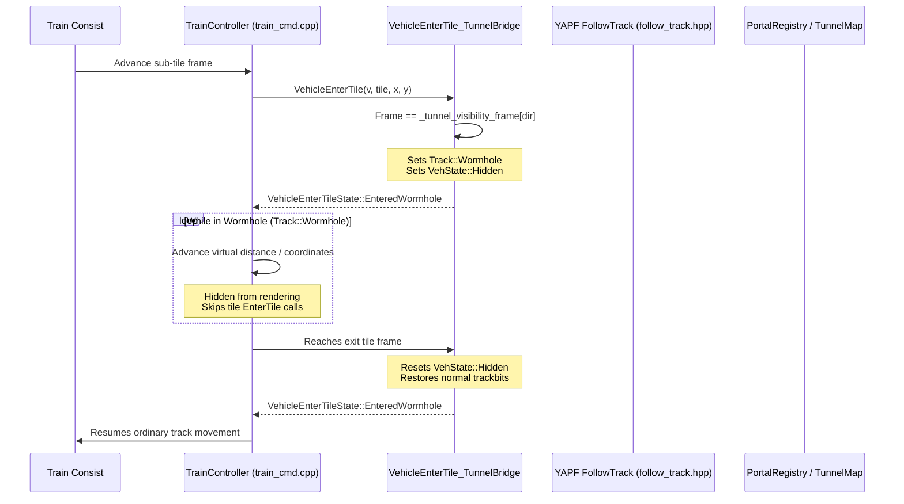

# OpenSpaceTTD Architectural Spike: Wormhole Portal Gates & Multi-World Mechanics

## 1. Executive Summary & Premise

OpenSpaceTTD aims to deliver Factorio-scale industrial production chains and Peter F. Hamilton-style inter-planetary rail networks interlinked via fixed wormholes.

To preserve OpenTTD's battle-tested engine, performance, deterministic multiplayer synchronization, and savegame stability, OpenSpaceTTD adopts two foundational architectural constraints:
1. **Preserve `TileIndex` and Map Structure:** Do not rewrite the engine into a multi-map hierarchy. Instead, partition the single coordinate map space (up to 4096×4096) into discrete **logical world regions** separated by void boundaries.
2. **Adapt OpenTTD's Wormhole Subsystem:** Rather than inventing a bespoke transport mechanism, generalize OpenTTD's existing tunnel/bridge wormhole architecture (`Track::Wormhole`, `VehicleEnterTileState::EnteredWormhole`, `GetOtherTunnelBridgeEnd`, and YAPF `CFollowTrackT`).

This document presents the findings, call-graph analysis, and working prototype resulting from the wormhole portal architectural spike.

---

## 2. Deep-Dive: OpenTTD's Existing Wormhole Subsystem

### 2.1 The Wormhole Concept in OpenTTD
In OpenTTD, tunnels and bridges are classified internally as **wormholes**. When a train enters a tunnel or crosses a bridge:
- It does **not** occupy regular trackbits on intermediate physical map tiles.
- Its track status changes to `Track::Wormhole` (`Track::Wormhole = 6` in [src/track_type.h](file:///home/flax/games/openspacettd/src/track_type.h)).
- For tunnels, the vehicle's sprite is hidden from rendering via `v->vehstatus.Set(VehState::Hidden)`.
- It re-emerges at the opposite end tile when its progress matches the tunnel length.

### 2.2 Vehicle Lifecycle in a Wormhole


### 2.3 The Spatial Coupling Assumptions in Standard OpenTTD
Standard OpenTTD tunnels were designed for straight-line mountain crossings on a single contiguous landscape. Consequently, the original implementation relies on five spatial assumptions:

1. **Strict Axis-Alignment:** Standard tunnels require entrance and exit to lie along the exact same row (`x1 == x2`) or column (`y1 == y2`).
2. **Height Matching:** `GetOtherTunnelEnd` requires `GetTileZ(tile) == z`.
3. **Raymarching Search:** `GetOtherTunnelEnd` finds the other end by stepping one tile at a time along `delta = TileOffsByDiagDir(dir)` until hitting a matching tunnel entrance.
4. **Physical Coordinate Traversal:** `GetNewVehiclePos(v)` increments the vehicle's `x_pos` and `y_pos` along the physical coordinate grid between the entrance and exit tiles.
5. **Consist Euclidean Proximity:** `CheckTrainsLengths()` in [src/train_cmd.cpp](file:///home/flax/games/openspacettd/src/train_cmd.cpp) asserts that every wagon `w` in a consist is positioned at `std::max(abs(u->x_pos - w->x_pos), abs(u->y_pos - w->y_pos)) == u->CalcNextVehicleOffset()` from its preceding vehicle `u`.

---

## 3. The OpenSpaceTTD Portal Architecture

### 3.1 Logical World Region Partitioning
Rather than changing `TileIndex` (which is baked into 32-bit integers across hundreds of thousands of lines of code, network sync packets, and save/load chunks), OpenSpaceTTD partitions the 4096×4096 map into logical world regions:

```
+-------------------+-------------------+
|                   |                   |
|     WORLD 0       |     WORLD 1       |
|  (Core / Earth)   |  (Mining Colony)  |
|   [0..1023,       |  [2048..3071,     |
|    0..1023]       |   0..1023]        |
|                   |                   |
+ - - - - - - - - - + - - - - - - - - - +
|    VOID BUFFER    |    VOID BUFFER    |
| (TileType::Void)  | (TileType::Void)  |
+ - - - - - - - - - + - - - - - - - - - +
|                   |                   |
|     WORLD 2       |     WORLD 3       |
| (Manufacturing)   | (Forge Colony)    |
|   [0..1023,       |  [2048..3071,     |
|    2048..3071]    |   2048..3071]     |
|                   |                   |
+-------------------+-------------------+
```

- Each world is surrounded by a perimeter of `TileType::Void` tiles, preventing player construction or natural vehicle runaway across borders.
- All OpenTTD map indexing (`TileXY`, `TileX`, `TileY`) continues to function natively.

### 3.2 Explicit Portal Pairing Table (`PortalRegistry`)
To connect portals across worlds or diagonal coordinates without raymarching, we introduce an explicit `PortalRegistry`:

```cpp
struct PortalEndpoint {
    TileIndex tile;         // Coordinate in World A
    DiagDirection enter_dir;// Direction into the portal gate
    WorldID world_id;       // Logical world ID
};

struct PortalLink {
    PortalID id;
    PortalEndpoint end_a;
    PortalEndpoint end_b;
    uint32_t virtual_length;// Traversal duration & YAPF routing cost
    bool bidirectional;
};
```

- **O(1) Resolution:** When querying `GetOtherTunnelBridgeEnd(tile)` or `GetOtherTunnelEnd(tile)`, the engine first checks `PortalRegistry::IsPortalTile(tile)`. If matched, it returns the paired destination tile in O(1) time.
- **Configurable Virtual Length:** `GetTunnelBridgeLength(tile_a, tile_b)` returns `virtual_length`, which directly informs YAPF pathfinding cost and travel time.

### 3.3 Pathfinding & Signal Integration (YAPF & PBS)
In OpenTTD's pathfinder [src/pathfinder/follow_track.hpp](file:///home/flax/games/openspacettd/src/pathfinder/follow_track.hpp):
```cpp
if (IsTileType(this->old_tile, TileType::TunnelBridge)) {
    DiagDirection enterdir = GetTunnelBridgeDirection(this->old_tile);
    if (enterdir == this->exitdir) {
        if (IsTunnel(this->old_tile)) {
            this->is_tunnel = true;
            this->new_tile = GetOtherTunnelEnd(this->old_tile);
        }
        this->tiles_skipped = GetTunnelBridgeLength(this->new_tile, this->old_tile);
        return;
    }
}
```
Because `GetOtherTunnelEnd` and `GetTunnelBridgeLength` hook into `PortalRegistry`:
1. `CFollowTrackRail::FollowTileExit` immediately resolves `new_tile` to the remote world's portal entrance.
2. `tiles_skipped` is assigned `virtual_length`.
3. In YAPF rail cost calculation ([src/pathfinder/yapf/yapf_costrail.hpp](file:///home/flax/games/openspacettd/src/pathfinder/yapf/yapf_costrail.hpp)):
   `segment_cost += YAPF_TILE_LENGTH * follower->tiles_skipped;`
   The pathfinder automatically calculates the true routing penalty of taking the wormhole gate across worlds!
4. PBS (Path-Based Signalling): `SetTunnelBridgeReservation(tile, true)` reserves the portal head. Because `HasTunnelBridgeReservation` is a bit on `TileBase` (`m5` bit 4), both the entry and exit portal tiles can be independently or jointly reserved by PBS.

### 3.4 Train Consist Continuity Across Coordinate Discontinuities
When a train crosses an inter-world portal from `(100, 100)` to `(3000, 3000)`:
- If a 5-wagon train enters the portal, Wagon 1 enters `Track::Wormhole` while Wagons 2..5 are still in World 0 outside the portal.
- While inside `Track::Wormhole`, the wagon is hidden (`VehState::Hidden`).
- **Required Phase 2 Adaptation:** In standard OpenTTD, `CheckTrainsLengths()` checks Euclidean distance between adjacent wagons. For vehicles entering/exiting a portal wormhole, the consistency check must recognize `u->track == Track::Wormhole` or account for the portal transition offset so length assertion does not fail during the transition.

---

## 4. Prototype Implementation & Validation

The prototype was implemented in the OpenSpaceTTD tree:
1. **[src/portal/portal_type.h](file:///home/flax/games/openspacettd/src/portal/portal_type.h)**: Defines `WorldID`, `PortalID`, `PortalEndpoint`, and `PortalLink`.
2. **[src/portal/portal_registry.h](file:///home/flax/games/openspacettd/src/portal/portal_registry.h) & [src/portal/portal_registry.cpp](file:///home/flax/games/openspacettd/src/portal/portal_registry.cpp)**: Fast hash-map registry for portal lookup and registration.
3. **[src/tunnelbridge_map.h](file:///home/flax/games/openspacettd/src/tunnelbridge_map.h) & [src/tunnelbridge.h](file:///home/flax/games/openspacettd/src/tunnelbridge.h)**: Integrated O(1) portal interception in `GetOtherTunnelBridgeEnd`, `GetOtherTunnelEnd`, and `GetTunnelBridgeLength`.
4. **[src/tests/test_portal_wormhole.cpp](file:///home/flax/games/openspacettd/src/tests/test_portal_wormhole.cpp)**: Catch2 unit test suite.

### 4.1 Test Results
The test suite validates four distinct capabilities:
- **`PortalRegistry - Basic Pairing and Lookups`**: Confirmed bidirectional endpoint lookups, invalid tile protection, and unregistration.
- **`PortalRegistry - Multi-World Topologies and Validation`**: Confirmed multiple distinct world pairs (World 0 <-> World 1, World 1 <-> World 2) without crosstalk.
- **`Portal Wormhole - Engine Hook Integration`**: Confirmed that `GetOtherTunnelBridgeEnd()` and `GetTunnelBridgeLength()` resolve non-colinear diagonal coordinates across the map.
- **`Portal Wormhole - YAPF Track Follower Traversal`**: Confirmed that `CFollowTrackRail::FollowTileExit` leaps across the world coordinate gap and populates `tiles_skipped` from `virtual_length`.

**Execution Metrics:**
- **Unit Tests:** 4/4 test cases (44 assertions) passed in `< 0.01s`.
- **CTest Suite:** 103/103 tests passed with 0 regressions.
- **Binary Launch:** `./build/openttd -h` runs cleanly.

---

## 5. Phase 2 Implementation Roadmap

With the wormhole portal mechanics proven and verified, the following sequence provides the clear path for full gameplay integration:

1. **Consist Wormhole Stepping:**
   Enhance `TrainController` in `src/train_cmd.cpp` so that when a wagon enters a portal head, its virtual coordinate increments along a dedicated virtual track length rather than spatial grid coordinates, and teleports `x_pos, y_pos` to the destination portal tile upon emergence.
2. **World Region Generation & Boundaries:**
   Implement world layout generator configuring the 4096×4096 map into $N \times M$ world cells bounded by `TileType::Void` buffers, each with its own climate/landscape biome.
3. **Save/Load Serialization (`CHUNK_PORT`):**
   Implement `portal_sl.cpp` in `src/saveload/` to persist registered portal pairs and world configurations inside the standard savegame chunk format.
4. **Portal Construction Commands & GUI:**
   Introduce `CmdBuildPortal` allowing players to construct matched portal gates using high-tier materials, with a dedicated portal destination selector window.
